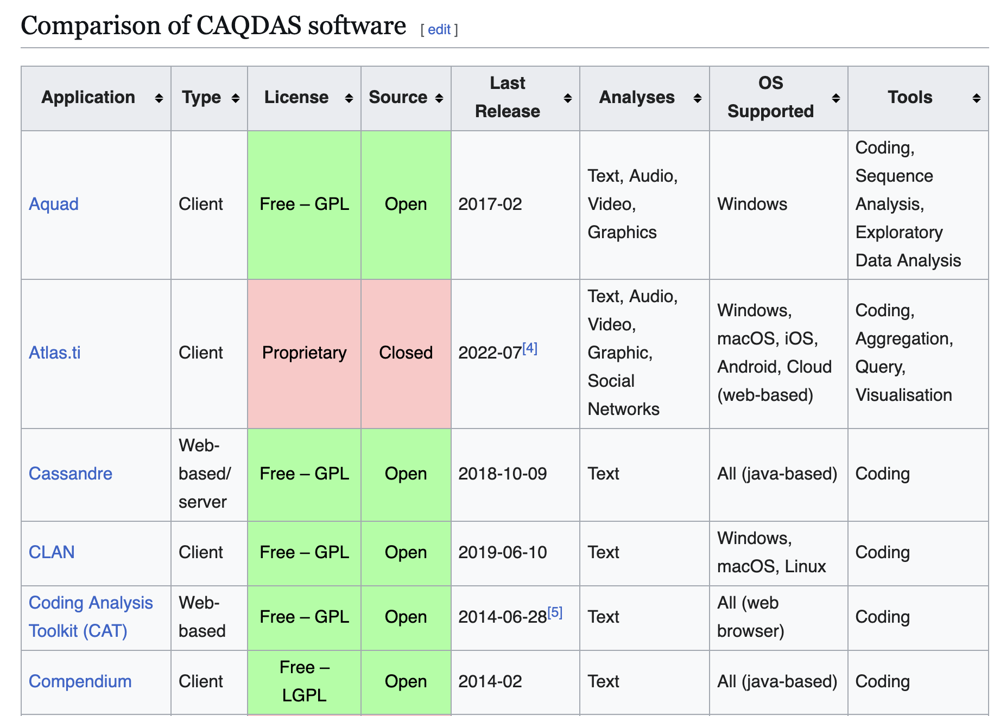
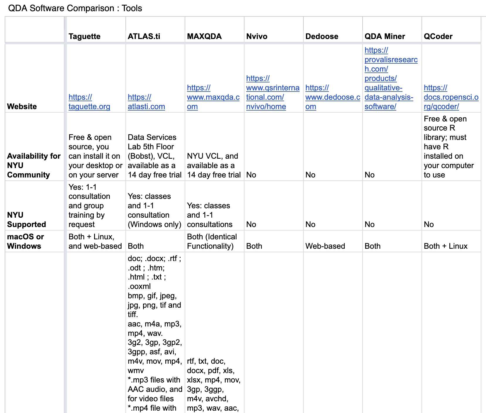
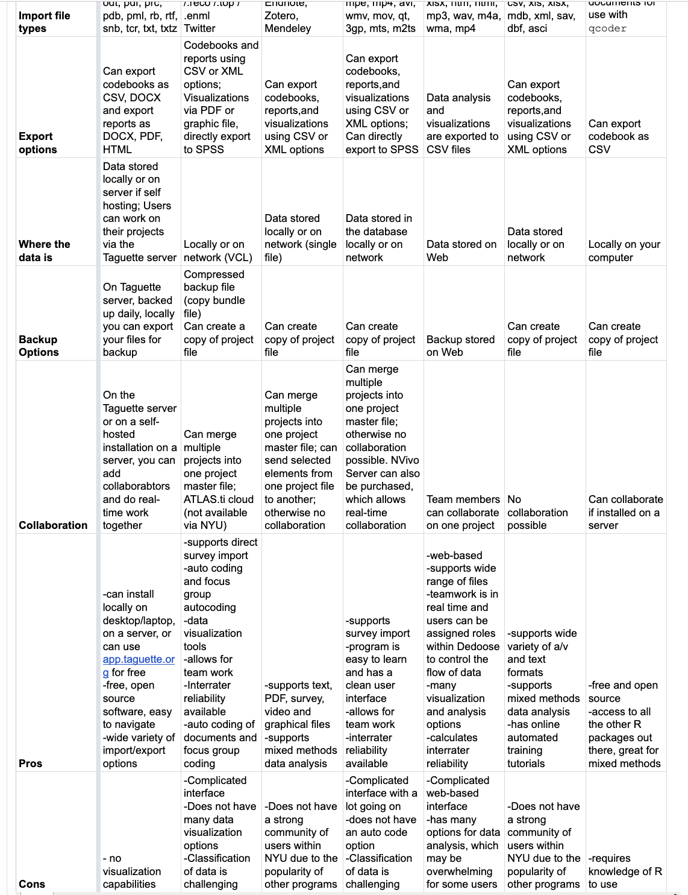
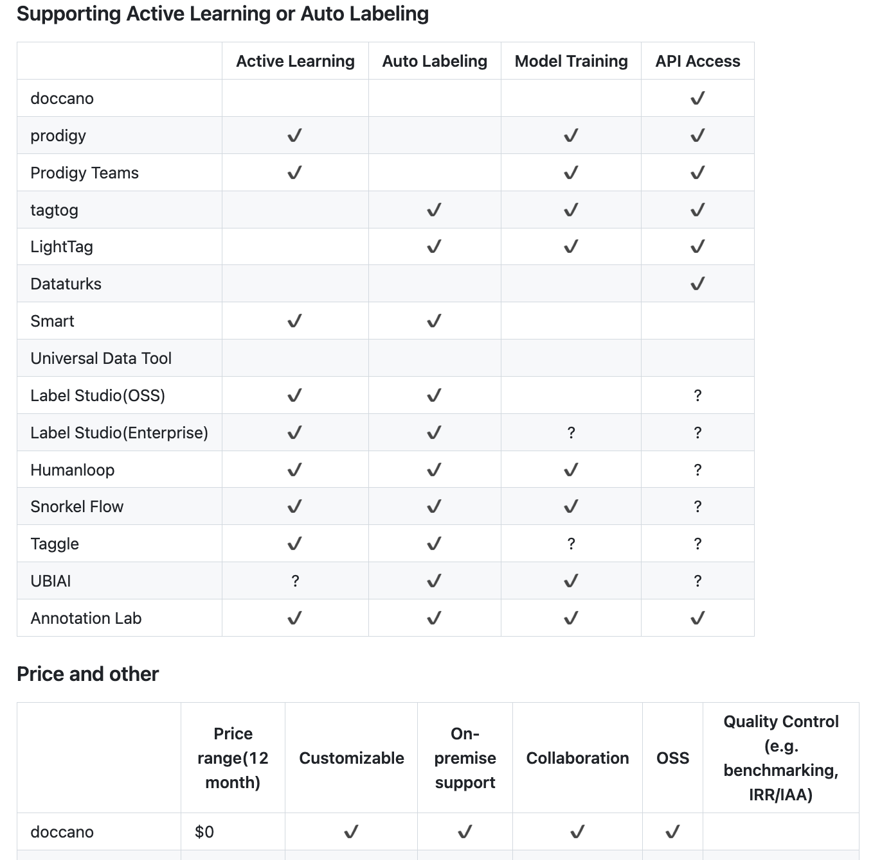

# Exemples de grilles d'évaluation

## Objectif

- Trouver quelques exemples de grilles d'évaluation déjà proposées sur le sujet et/ou sur de l'éval de logiciel, histoire de ne pas réinventer la roue.
- lister les critères existants dans ces grilles
- aviser de ceux qui pourraient être pertinent
- donner une idée "visuelle" de comment ça pourrait se traduire (tableau, + compléter avec avis texte, etc.)

## Exemples existants

Quelques exemples sur des sujets connexes :

- Grille caqdas des [NYU Libraries](https://guides.nyu.edu/QDA/comparison)
- Même esprit sur cette page [wikipedia](https://en.wikipedia.org/wiki/Computer-assisted_qualitative_data_analysis_software#Free_.2F_open_source_software_for_CAQDAS)
- Ou sur ce repo [github](https://github.com/doccano/awesome-annotation-tools)

Aperçu :

<!-- Si besoin de mettre en plus petit par html

 -->

## Listes de critères

### Ce que l'on avait évoqué précédement en vrac :
- texte uniquement/multimodal
- ouvert/fermé
- service/logiciel on premise
- type de tache : classification / segmentation
- uniquement annotation/intégration ML/DL
- académique / non académique
- coloration disciplinaire/communauté d'origine
- modèles classiques / modèles encodeurs / LLM
- outil spécifique sur une tâche / plateforme avec de nombreuses fonctions (topic analysis)
- confidentiel / forte adoption
- plus maintenu / maintenu
- orienté équipe / orienté crowdworking
- orienté humain (création de l'information) / orienté automatisation (correction de la prédiction)
- uniquement annotation / analyse & indicateurs
- données plates / gestion avancées de données
- utilisateur crée les ontologies / ontologies extérieures - sémantisation
- orienté document / orienté corpus / orienté modèle
- fenêtre d'attention
- degré de modularité
- intuitif / complexe (UX et déploiement)

### Critères wiki
- Application
- Type
- License
- Source
- Last Release
- Analyses
- OS Supported
- Tools 

### Critères NYU
- Website
- Availability for NYU Community
- NYU Supported
- macOS or Windows
- Import file types
- Export options
- Where the data is
- Backup Options
- Collaboration
- Pros
- Cons

### Critères Doccano
- Supporting Tasks
  - Classification
  - Sequence Labeling
  - Seq2seq
  - Relation
  - Dictionary
  - Choice
- Supporting Active Learning or Auto Labeling
  - Active Learning
  - Auto Labeling
  - Model Training
  - API Access
- Price and other
  - Price range(12 month)
  - Customizable
  - On-premise support
  - Collaboration
  - OSS
  - Quality Control (e.g. benchmarking, IRR/IAA)

### Sous forme grille Wiki
| Item d'évaluation | Description | Exemples de modalités |
|---|---|---|
| Application | Nom du logiciel ou de l'outil. | Aquad, ATLAS.ti, Cassandre, Dovetail, Dedoose, ELAN, KH Coder, MAXQDA, NVivo, QDAcity, etc. |
| Type | Type de déploiement ou d'accès. | Client, Web-based, Web-based/server, Client/Web-based, R package |
| License | Type de licence. | Free – GPL, Free – LGPL, Free – BSD, Proprietary, Proprietary (used to be GPL) |
| Source | Ouverture du code source. | Open, Closed |
| Last Release | Date de la dernière version. | 2017-02, 2022-07, 2025-11-10, 2026-02-09, Abandonné (ex: 2006) |
| Analyses | Types de données supportées. | Texte, Audio, Video, Graphics, Social Networks, PDF, Multimodal |
| OS Supported | Systèmes d'exploitation supportés. | Windows, macOS, Linux, iOS, Android, All (java-based), All (web browser) |
| Tools | Fonctionnalités ou outils intégrés. | Coding, Sequence Analysis, Exploratory Data Analysis, Aggregation, Query, Visualisation, Statistical Tools, Word extracting, Auto-coding, Topic analysis, IRR (Inter-Rater Reliability) |

### Sous forme grille NYU
| Item d'évaluation | Description | Exemples de modalités |
|---|---|---|
| Website | Lien vers le site officiel du logiciel. | Taguette, ATLAS.ti, MAXQDA, etc. |
| Availability | Disponibilité du logiciel pour une communauté ou institution spécifique. | Free & open source, 14-day free trial, No, Available via VCL, etc. |
| Support | Type de support institutionnel ou technique disponible. | 1-1 consultation, group training, classes, No support |
| OS Support | Systèmes d'exploitation supportés. | Both (Windows, macOS), Both + Linux, Web-based, Windows only |
| Import file types | Types de fichiers supportés pour l'importation. | .txt, .docx, .pdf, .mp3, .mp4, .xls, .html, etc. |
| Export options | Formats disponibles pour l'exportation des données ou résultats. | CSV, DOCX, PDF, HTML, XML, SPSS, Visualizations (PDF/graphic file) |
| Data storage | Où et comment les données sont stockées. | Locally, on server, on network, on web, single file |
| Backup options | Options de sauvegarde disponibles. | Daily backup on server, compressed backup file, copy of project file, no backup option |
| Collaboration | Fonctionnalités de collaboration (temps réel, fusion de projets, etc.). | Real-time collaboration, merge projects, no collaboration, server-based collaboration |
| Pros | Avantages ou points forts du logiciel. | Free & open source, easy to navigate, supports mixed methods, interrater reliability, visualization tools |
| Cons | Inconvénients ou limites du logiciel. | No visualization, complicated interface, requires R knowledge, limited community support |

## Table synthèse des critères wiki + NYU + Doccano

| Item d'évaluation | Description | Exemples de modalités |
|---|---|---|
| **--- Fiche tech ---** |  |  |
| Application + Website | Nom du logiciel + lien vers le site | Taguette, ATLAS.ti, MAXQDA, etc. |
| Type | Type de déploiement ou d'accès. | Client, Web-based, Web-based/server, Client/Web-based, R package |
| License | Type de licence (si enjeu préciser prix dans nos cas) | Free – GPL, Free – LGPL, Free – BSD, Proprietary, Proprietary (used to be GPL) |
| Availability (fusionner avec licence ?)| Disponibilité du logiciel pour une communauté ou institution spécifique. | Free & open source, 14-day free trial, No, Available via VCL, etc. |
| Last Release/maintenance | Date de la dernière version. | 2017-02, 2022-07, 2025-11-10, 2026-02-09, Abandonné (ex: 2006) |
| OS Supported | Systèmes d'exploitation supportés. | Windows, macOS, Linux, iOS, Android, All (java-based), All (web browser) |
| **--- Fonctionnalités et spécificités usage---** |  |  |
| Import file types | Types de fichiers supportés pour l'importation. | .txt, .docx, .pdf, .mp3, .mp4, .xls, .html, etc. |
| Export options | Formats disponibles pour l'exportation des données ou résultats. | CSV, DOCX, PDF, HTML, XML, SPSS, Visualizations (PDF/graphic file) |
| Data storage | Où et comment les données sont stockées. | Locally, on server, on network, on web, single file |
| Backup options | Options de sauvegarde disponibles. | Daily backup on server, compressed backup file, copy of project file, no backup option |
| Analyses | Types de données supportées. | Texte, Audio, Video, Graphics, Social Networks, PDF, Multimodal |
| Tools | Fonctionnalités ou outils intégrés. | Coding, Sequence Analysis, Exploratory Data Analysis, Aggregation, Query, Visualisation, Statistical Tools, Word extracting, Auto-coding, Topic analysis, IRR (Inter-Rater Reliability) |
| Supporting Tasks | Type de taches | Classification, Sequence Labeling, Seq2seq, Relation, Dictionary, Choice |
| Supporting Active Learning or Auto Labeling | Fonctionnalités active learning (idée de pouvoir en faire un truc IA dans notre cas) | Active Learning, Auto Labeling, Model Training, API Access |
| Collaboration | Fonctionnalités de collaboration (temps réel, fusion de projets, etc.). | Real-time collaboration, merge projects, no collaboration, server-based collaboration |
| **--- Avis final ---** |  |  |
| Pros | Avantages ou points forts du logiciel. | Free & open source, easy to navigate, supports mixed methods, interrater reliability, visualization tools |
| Cons | Inconvénients ou limites du logiciel. | No visualization, complicated interface, requires R knowledge, limited community support |

## Imaginer une typologie des critères ?

- certains qui pourraient être plus descriptifs / techniques
- d'autres plus sur l'adapatation à telle ou telle pratique ?
- un avis final pro/con plus quali ?

### Critères descriptifs

Critère,Description,Modalités/Exemples
Nom du logiciel,Nom et version du logiciel.,ATLAS.ti, MAXQDA, Taguette, Dedoose, NVivo, QCoder, etc.
Site web,Lien vers le site officiel.,https://atlasti.com, https://taguette.org, etc.
Type,Mode de déploiement.,Client, Web-based, Client/Web-based, R package, Serveur local.
Licence,Type de licence.,Open source (GPL, BSD), Propriétaire, Gratuit avec essai.
Maintenance,Dernière version, fréquence des mises à jour,Actif (2024-2026) / Peu actif / Abandonné
OS & Compatibilité,Plateformes supportées,Windows/macOS/Linux/Web/
Types de données,Formats de données supportés.,Texte, Audio, Vidéo, PDF, Images, Multimodal, Réseaux sociaux.
Fonctionnalités,Outils intégrés.,Codage, Analyse de séquences, Visualisation, Statistiques, Export SPSS, IRR, Auto-coding.
Import/Export,Formats supportés, interopérabilité,PDF, DOCX, CSV, JSON, RDF, etc.
Collaboration,Niveau de support (temps réel, fusion de projets, rôles),Temps réel / Fusion manuelle / Pas de collaboration
Sécurité,Confidentialité, stockage des données,Local / Cloud (chiffré) / Serveur dédié
Communauté,Adoption, support, documentation,Large adoption / Niche / Peu documenté
Prix,Coût (gratuit, abonnement, licence perpétuelle),$0 / $100–$1000 / $1000+

### Critères d’adéquation SHS
Catégorie,Critères,Modalités/Exemples
Tâches supportées,Classification, segmentation, analyse thématique, etc., Classification / Segmentation / Topic analysis / Relation extraction
Orientation disciplinaire,Coloration disciplinaire, communauté d’origine,SHS / Linguistique / Informatique / Générique
Modèles sous-jacents,Classiques, encodeurs, LLM, hybride,Modèles classiques / LLM / Hybride
Gestion des données,Données plates, hiérarchisées, ontologies,Données plates / Ontologies internes / Ontologies externes
Automatisation,Niveau d’intégration ML/DL, correction de prédictions,Manuel / Semi-automatisé / Full auto-labeling
Modularité,Degré de modularité, personnalisation,Modulaire / Monolithique
Expérience utilisateur,Complexité, courbe d’apprentissage, UX,Intuitif / Complexe / Nécessite une formation
Fenêtre d’attention,Capacité à gérer des contextes larges ou restreints,Large (corpus) / Restreinte (document)
Analyse & Indicateurs,Outils d’analyse intégrés (statistiques, visualisation),Visualisation / Statistiques / Benchmarking

Critère,Description,Modalités/Exemples
Orientation disciplinaire,Adaptation aux disciplines SHS (sociologie, linguistique, etc.).,SHS, Linguistique, Informatique, Générique.
Collaboration,Niveau de support pour le travail d'équipe.,Temps réel, Fusion de projets, Pas de collaboration, Rôles utilisateurs.
Gestion des données,Structure et organisation des données.,Données plates, Ontologies internes/externes, Base de données relationnelle.
Automatisation,Intégration de ML/DL ou outils d'auto-coding.,Manuel, Semi-automatisé, Auto-labeling, Active Learning.
Modularité,Flexibilité et personnalisation.,Modulaire, Monolithique, Plugins/Extensions.
Expérience utilisateur,Facilité d'utilisation et courbe d'apprentissage.,Intuitif, Complexe, Nécessite une formation.
Sémantisation,Support pour la création ou l'import d'ontologies.,Ontologies internes, Ontologies externes, Pas de support.
Analyse & Indicateurs,Outils d'analyse intégrés (statistiques, visualisation, IRR).,Visualisation, Statistiques, Benchmarking, Export SPSS/R.
Confidentialité,Niveau de sécurité et stockage des données.,Local, Serveur dédié, Cloud (chiffré), Pas de contrôle.
Support CNRS,Compatibilité avec les infrastructures CNRS (ex : Huma-Num, Nakala).,Intégration possible, Pas de support, Documentation CNRS.
Communauté,Adoption et support communautaire (forums, tutoriels).,Large adoption, Niche, Peu documenté.

ÉVAL QUALI ?
Avantages,Points forts du logiciel.,Open source, Visualisation avancée, IRR intégré, Support multimodal, Collaboration temps réel.
Inconvénients,Limites ou défis.,Interface complexe, Pas de visualisation, Nécessite des compétences en R, Peu de support communautaire.
Cas d'usage SHS,Exemples d'utilisation en SHS.,Analyse de discours, Études qualitatives, Linguistique de corpus, Histoire orale.
