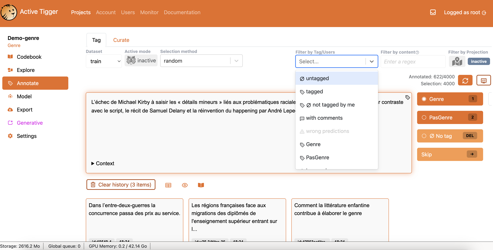

# Active Tigger

Dernière modification de la fiche : 28/08/2026

Version testée : v1.1

Site web : [https://activetigger.com](https://activetigger.com)

Code : [https://github.com/activetigger/activetigger](https://github.com/activetigger/activetigger)

Citer le logiciel : 

> Schultz, E., Boelaert, J., Morin, A., Bonutti D'Agostini, E., Claesson, A., Ollion, É., & Chatelain, A. (2026). « ActiveTigger: An open source collaborative text annotation software for computational social sciences ». *Proceedings of the 18th International Conference on Statistical Analysis of Textual Data (JADT 2026)*, Palerme, Italie.

## Description générale

*Outil web collaboratif d'annotation de textes pour les sciences sociales computationnelles, centré sur la classification de grands corpus avec apprentissage actif et fine-tuning de modèles de type BERT.*

Active Tigger est une application web (serveur + client dans le navigateur) pensée pour accélérer la classification de corpus textuels de grande taille (articles de presse, publications de réseaux sociaux, etc.) en s'appuyant sur l'apprentissage supervisé et les modèles préentrainés. Le logiciel est pensé en priorité à destination des chercheurs en sciences sociales qui débutent en apprentissage supervisé sur du texte et voulant faire du traitement de données textuelles. Le flux de travail typique consiste à importer un corpus de textes, définir un guide de codage, annoter un échantillon, puis entraîner un modèle pour prédire les annotations sur les éléments non annotés, progressivement améliorer ce modèle (en utilisant potentiellement les prédictions pour sélectionner des éléments), puis basculer sur des modèles pré-entrainés BERT pour les fine-tuner et améliorer la prédiction. Le produit final est souvent un classifieur qui permet d'étendre la classification sur l'ensemble du corpus, pour ensuite permettre de faire des analyses. Différentes fonctionnalités permettent en outre l'exploration du corpus, la recherche d'éléments. De manière expérimentale, il est possible aussi de faire de la classification d'image et des entités nommées.

## Licence

*Logiciel libre sous licence EUPL-1.2 (European Union Public Licence), gratuit.*

Le développement est porté par le groupe CSS (CREST/ENSAE/Institut Polytechnique de Paris), avec des financements publics (DRARI Île-de-France, Progedo, ANR Pantagruel).

## Installation

*Le logiciel peut être déployé à partir de docker, ou installé sur en ligne de commande (back-end et front-end séparés). Il y a une  instance en ligne hébergée (sur demande de compte) ; un GPU est recommandé pour l'entraînement des modèles.*

Pour une installation autonome, le déploiement recommandé passe par Docker Compose (backend FastAPI/Python, frontend React) sur sa machine ou un serveur cloud ; une installation manuelle est possible avec une base de données plus légère. Le logiciel fonctionne sur CPU, mais un GPU accélère significativement l'entraînement et les prédictions (BERT, sentence-BERT). Pas de logique de plugin. Une instance de démonstration est hébergée sur les serveurs du groupe ENSAE-ENSAI (avec GPU) : l'accès se fait par un formulaire de demande de compte, destiné aux chercheurs ayant des données textuelles à annoter.   

## Corpus 

*Corpus textuels uniquement, importés sous forme tabulaire (une ligne par élément à annoter).*

Les données sont importées aux formats CSV, XLSX ou Parquet, avec une colonne d'identifiant unique, une ou plusieurs colonnes de texte, et éventuellement des colonnes de contexte (auteur, date, source). Le logiciel est adapté aux textes courts ou segmentés (tweets, titres, paragraphes) ; il n'est pas conçu pour l'annotation de passages dans des documents longs, ni pour l'audio, la vidéo ou les images.

## Interopérabilité

*Import et export tabulaires classiques ; les annotations, prédictions et même les poids des modèles affinés sont exportables.*

L'export couvre les annotations (jeu complet ou ensembles train/test, avec les colonnes d'origine et une colonne par schéma de codage), les prédictions du modèle sur l'ensemble du corpus ou sur un jeu externe, les features et les coordonnées de projection issues de la visualisation, ainsi que les poids du modèle BERT affiné (réutilisable en dehors du logiciel). Le format de sortie peut être Parquet ou CSV.

## Communauté

*Communauté en structuration autour d'une équipe de recherche française active, avec documentation en anglais et présentations en français.*

La documentation officielle est en anglais ([https://activetigger.com/documentation/](https://activetigger.com/documentation/)). Un serveur Discord sert à l'entraide et les issues GitHub au signalement de bugs. Des présentations existent en français (Vendredis Quanti, séminaires) et en anglais (PyData 2025, vidéo YouTube). Plusieurs publications francophones en sciences sociales utilisent déjà le logiciel (Actes de la recherche en sciences sociales, Revue française de science politique, Sciences sociales et santé), signe d'une diffusion dans les réseaux de recherche français.

## Collaboratif

*Conçu comme collaboratif : plusieurs annotateurs sur un même projet avec une gestion des rôles.*

La gestion des utilisateurs distingue quatre rôles : root (administration de l'instance), manager (créateur du projet, tous droits), collaborator (comme manager sans la suppression) et annotator (accès limité au codebook, à l'exploration et à l'annotation). Cela permet d'organiser des campagnes d'annotation en équipe. Les aspects collaboratifs ne sont pas encore bien documentés.

## IA

*L'apprentissage automatique est au cœur de l'outil (active learning, fine-tuning BERT) ; l'IA générative est disponible en option via des API externes.*

Active Tigger est pensé autour de la boucle humain-modèle : l'annotation manuelle sert à entraîner des modèles (classifieurs rapides puis BERT affiné) qui à leur tour priorisent et accélèrent l'annotation (active learning). Ces fonctions restent pilotées par l'utilisateur, qui garde la main sur les annotations. S'y ajoute une page « Generative », optionnelle et expérimentale, qui permet d'annoter ou d'extraire de l'information par prompts en connectant des modèles externes : OpenAI, OpenRouter, Ollama (modèles locaux possibles), HuggingFace ou IaaS académiques. L'utilisateur choisit le modèle, l'endpoint et fournit son propre jeton d'accès ; les prompts utilisent des balises `[[TEXT]]` et de variables de contexte. À noter que les LLM externes s'exécutent sur des serveurs tiers, ce qui pose les questions habituelles de confidentialité des données.

## Prise en main

*Liste des retours d'expérience des utilisateurs (identifiés pour accepter la dimension subjective)*

**Retour d'expérience (Émilien Schultz) :**

Le logiciel est pensé en priorité pour une tâche spécifique de mise à l'échelle d'annotations sur un corpus, et d'accompagner les différentes étapes, notamment le moment de stabilisation de la grille de codage et de mesure de la qualité de la prédiction. Il permet aussi de se familiariser aux notions d'apprentissage supervisé sans avoir besoin de manipuler du code, et en étant accompagné dans les différentes étapes notamment d'évaluation des modèles.