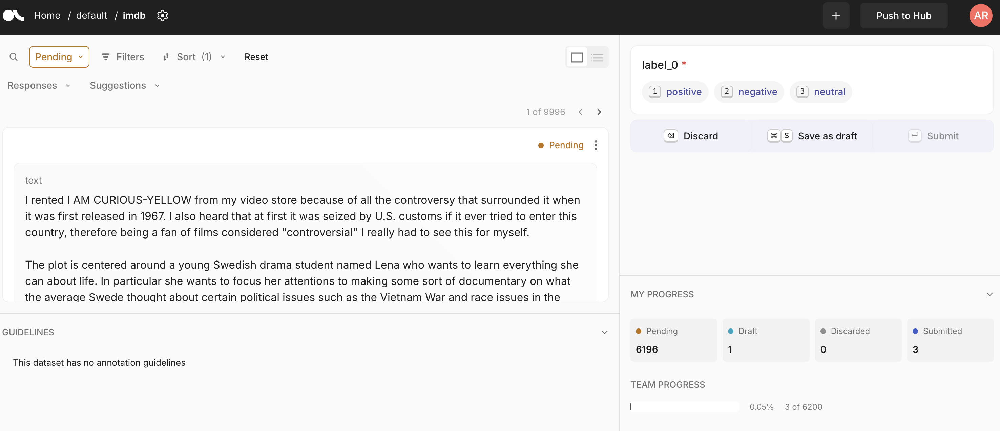

# Argilla

Dernière modification de la fiche : 28/08/2026

Version testée : v2.8.0

Site web : [https://docs.argilla.io/latest/](https://docs.argilla.io/latest/)

Code : [https://github.com/argilla-io/argilla](https://github.com/argilla-io/argilla)

Citer le logiciel : 

> Vila-Suero, Daniel & Aranda, Francisco (2023). *Argilla - Open-source framework for data-centric NLP*. https://github.com/argilla-io/argilla

## Description générale

*Plateforme web collaborative de construction de datasets annotés pour l'IA/NLP, pilotée par un framework Python : l'interface sert à annoter, la configuration des projets se fait par le code.*

Argilla se présente comme un outil de collaboration entre « ingénieurs IA » et experts métier pour produire des jeux de données de qualité destinés à l'entraînement et l'évaluation de modèles. Le fonctionnement repose sur un couple serveur web / client Python : les datasets (champs, questions, consignes) sont définis et chargés par programmation, puis les annotateurs travaillent dans l'interface web (filtres, recherche sémantique, suggestions de modèles, rendu Markdown). Il couvre les tâches de NLP classiques (classification, NER) comme les usages récents autour des LLM (annotation de préférences, évaluation de RAG, feedback utilisateur) et du multimodal (classification d'images). La philosophie affichée est « data-centric » : itérer sur la qualité des données plutôt que sur les modèles.

## Licence

*Logiciel libre sous licence Apache 2.0, gratuit.*

Développé initialement par la société Argilla, dont l'équipe a rejoint Hugging Face en 2024. Le dépôt est désormais en mode maintenance : les mainteneurs qualifient le code de « mature et stable » mais aucune nouvelle fonctionnalité n'est planifiée (voir la section Communauté).

## Installation

*Déploiement serveur par Docker ou hébergement gratuit sur Hugging Face Spaces ; l'usage complet nécessite Python*

Deux modes de déploiement : un conteneur Docker (machine locale ou serveur) ou par Hugging Face avec une instance hébergée (avec authentification via le compte Hugging Face). L'accès des annotateurs se fait ensuite par le navigateur. En revanche, la création des projets, le chargement des données et la récupération des annotations passent par Python.

## Corpus 

*Corpus textuels principalement (classification, NER, préférences LLM), avec un support multimodal pour les images.*

Les données sont chargées depuis n'importe quelle source accessible en Python (fichiers tabulaires via pandas, datasets Hugging Face, etc.), chaque enregistrement pouvant combiner plusieurs champs (texte, chat, image) et des métadonnées. L'outil est adapté aux éléments courts ou segmentés à classifier ou étiqueter, pas à l'annotation de passages dans des documents longs, ni à l'audio ou la vidéo.

## Interopérabilité

*Import/export principalement programmatique via le client Python, avec un import sans code existe dans l'interface, mais uniquement depuis le Hugging Face Hub.*

Il n'est pas possible d'importer directement un fichier CSV depuis l'interface : soit on lit le fichier en Python (par exemple avec pandas) puis on charge les lignes via Python, soit on dépose d'abord le CSV dans un repo du Hugging Face Hub puis on utilise le bouton « Import dataset from Hugging Face » de l'interface. Côté export, les datasets complets (configuration + enregistrements) s'exportent vers le Hub ou sur disque ; les enregistrements seuls s'exportent en dictionnaires, listes Python ou objets datasets de Hugging Face. Il n'y a pas non plus d'export CSV/JSON direct depuis l'interface.

## Communauté

*Communauté importante issue de l'écosystème NLP open source, mais projet passé en maintenanc.*

Le projet compte plus de 5k étoiles sur GitHub, un Discord actif et une documentation fournie en anglais (tutoriels, guides). L'ancrage est celui de la communauté machine learning / Hugging Face et les ressources francophones sont rares. Surtout, depuis le rachat par Hugging Face, les auteurs originaux sont passés à d'autres projets et le dépôt cherche des mainteneurs : le logiciel illustre le risque, souligné dans ce rapport, des outils de recherche dont la maintenance dans la durée n'est pas garantie.

## Collaboratif

*Pensé pour des campagnes d'annotation en équipe : workspaces, rôles, distribution automatique des tâches.*

Argilla organise le travail en workspaces regroupant datasets et utilisateurs, avec des rôles différenciés (owner, admin, annotator) et une authentification OAuth2 possible. La distribution des tâches entre annotateurs est gérée par l'outil (nombre minimal de réponses par enregistrement pour marquer une tâche comme complète), et chaque annotateur ne voit que ce qui lui est soumis. Les réponses de plusieurs annotateurs sur un même enregistrement sont conservées, ce qui permet des analyses d'accord en aval (via le SDK).

## IA

*L'IA est présente comme assistance optionnelle : pré-annotations par « suggestions » de modèles, recherche sémantique, et génération de données via l'écosystème Hugging Face.*

Le mécanisme central est celui des « suggestions » : n'importe quel modèle (règles, classifieur, LLM) peut pré-remplir les annotations via le client Python, l'annotateur validant ou corrigeant dans l'interface — le choix des modèles est donc entièrement libre et externe à l'outil. La recherche sémantique (vecteurs) aide à explorer le corpus. L'intégration avec la bibliothèque distilabel (même écosystème) permet de générer ou d'améliorer des datasets avec des LLM puis de les faire vérifier par des humains. Ces fonctions sont optionnelles : l'outil fonctionne entièrement en annotation manuelle.

## Prise en main

*Liste des retours d'expérience des utilisateurs (identifiés pour accepter la dimension subjective)*

