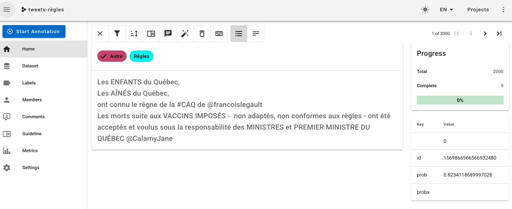

# Doccano

Dernière modification de la fiche : 6/07/2026

Version testée : 1.8.5

Site web : [https://doccano.web.webis.de/fr](https://doccano.web.webis.de/fr)

Code : [https://github.com/doccano/doccano](https://github.com/doccano/doccano)

Citer le logiciel : 

> @misc{doccano,
>  title={{doccano}: Text Annotation Tool for Human},
>  url={https://github.com/doccano/doccano},
>  note={Software available from https://github.com/doccano/doccano},
>  author={
>    Hiroki Nakayama and
>    Takahiro Kubo and
>    Junya Kamura and
>    Yasufumi Taniguchi and
>    Xu Liang},
>  year={2018},
>}

## Description générale

*Petit logiciel épuré en Python pour réaliser les principales tâches d'annotation de corpus textuels.*

Logiciel d'annotation "pour les humains" qui fonctionne avec un serveur et un client web par le navigateur, et permet de travailler à plusieurs sur un même projet. Il permet différents types de tâches : classification de textes, de séquences textuelles, d'images, d'objets (segmentation). Il est multilingue avec une interface fluide pour faciliter l'annotation des éléments. Néanmoins, il semble moins maintenu et ne parait pas avoir une dynamique très forte d'usage dans la recherche. 

## Licence

*Logiciel libre sous license MIT*

## Installation

*Déploiement du logiciel par un Docker et possible de l'installer sur un serveur accès web.*

Doccano est développé en Python. Son installation est possible directement en Python (3.8). Il peut y avoir quelques soucis sous Windows + il faut bien penser à prendre une version 3.8+ de Python pour l'installation. Il y a aussi un docker permet de déployer l'instance rapidement. Il ne semble pas y avoir de logique de plugin.

## Corpus 

*Import de corpus textuels classiques dans les formats de bas niveaux classiques.*

Doccano permet d'annoter des données textuelles et des images. Les données textuelles sont chargées sous la forme de tableaux. Les formats d'entrées sont assez variés : csv, plain text, excel, jsonl, CoNLL.

## Interopérabilité

*Le logiciel importe des données tabulaires et exporte un json avec les annotations.*

Doccano prend en entrée des données tabulaires et permet l'extraction des données annotées. L'export des annotation se fait en jsonl. Le chargement des corpus n'est pas entièrement fluide (choix des colonnes de métadonnées, vues du dataset, ...).

## Communauté

*Un logiciel avec peu de soutien communautaire en dehors de la documentation officielle : https://doccano.github.io/doccano/*

La communauté est assez restreinte. S'il a 10k étoiles sur Github, il est peu cité dans les articles francophones de sciences sociales. Il y a peu de tutoriaux communautaires sur le sujet. 

## Collaboratif

*Il est possible de collaborer sur un même projet mais pas de fonctionnalités avancées.*

Doccano permet de faire de l'annotation multiutilisateur. Il y a plusieurs modes : annotation parallèle, ou annotation collective. Par contre il n'y a pas de logique d'arbitrage entre les désaccords d'annotation. 

## IA

*La gestion de l'IA se fait avec des services extérieurs pour prédire des éléments.*

Doccano donne la possibilité de faire de l'auto-annotation en s'appuyant sur une API web externe https://doccano.github.io/doccano/advanced/auto_labelling_config/ (auto-labeling feature). Il est donc possible de construire ses propres annotateurs externes (quelle que soit la technologie) et l'utiliser pour l'annotation.