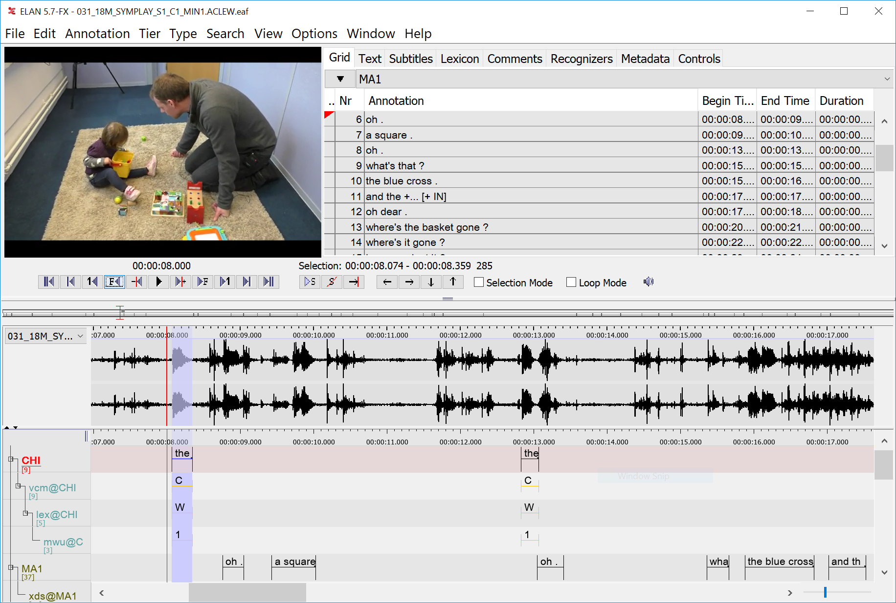

# Elan

Dernière modification de la fiche : 06/07/2026

Version testée : 7.1

Site web : [https://archive.mpi.nl/tla/elan](https://archive.mpi.nl/tla/elan)

Code : [https://archive.mpi.nl/tla/elan/download](https://archive.mpi.nl/tla/elan/download)

Citer le logiciel :

> "ELAN (Version 7.1) [Computer software]. (2026). Nijmegen: Max Planck Institute for Psycholinguistics, The Language Archive. Retrieved from https://archive.mpi.nl/tla/elan"

> Sloetjes, H., & Wittenburg, P. (2008). Annotation by category - ELAN and ISO DCR. In: Proceedings of the 6th International Conference on Language Resources and Evaluation (LREC 2008).

## Description générale

*Logiciel historique spécialisé d'annotation parallèle vidéo/son beaucoup utilisé par les communautés de linguistes*

Logiciel d'annotation de corpus d'enregistrements audios ou vidéos. Il permet d'annoter en ligne sur le signal sonore, de typer les lignes d'annotation et d'utiliser des vocabulaires contrôlés.
Certaines annotations peuvent être dépendantes d'une autre.   

La recherche sur corpus est possible avec un retour à l'annotation (via ouverture du fichier).

Possibilité de créer un extrait des audios/vidéos + annotations via le logiciel ffmpeg. 

Il permet de lier jusqu'à 4 fichiers vidéo à un document d'annotation, ce qui est fortement utile en langue des signes.

Disponibilités de quelques codes pour l'annotation automatique des silences par exemple.

## Licence

*Licensed under CC BY 4.0, les sources sont disponibles sous licence GPL 3.*

## Installation

*Installation simple et rapide avec un installeur*

Logiciel installé localement disponible sur Windows, Mac, Linux. 

## Corpus 

*Logiciel orienté en priorité vers des données syncronisées vidéos/audios*

Différents types de formats qui peuvent être alignés

- de l'audio
- des vidéos
- des tableurs
- des fichiers de sous-titres, de transcriptions
- des corpus parallèles

## Interopérabilité

*Logiciel appartenant à la liste des logiciels de conversion de transcription et annotation morphosyntaxique via teiconvert : [https://ct3.ortolang.fr/teiconvert/index-fr.html](https://ct3.ortolang.fr/teiconvert/index-fr.html)*

- Import : Transcriber, Clan, Praat, tableurs, fichiers de sous titres, ...
- Export : eaf (format xml), tableur (possibilité de réinjecter des annotations ou les modifier via le tableur), Praat 

Possibilité d'exporter le template des lignes d'annotations et les vocabulaires. 

Usage souvent couplé avec [AVAA Toolkit](https://journals.openedition.org/revuehn/4380).

## Communauté

*Le logiciel est bien établi et largement cité par la communauté scientifique avec de nombreux tutoriels et usagers experts actifs.*

Manuel/Guide : [https://archive.mpi.nl/tla/elan/documentation](https://framagroupes.org/sympa/info/qualcoder-fr)

Forum, liste de diffusion, contact : [https://archive.mpi.nl/tla/elan/support](https://archive.mpi.nl/tla/elan/support)

## Collaboratif

*Le logiciel n'est pas prévu pour le collaboratif*

- Le partage des fichiers se fait facilement car un enregistrement = 1 fichier et les corpus sont gérés via le module de recherche uniquement. L'export des vocabulaires contrôlés et du modèle d'annotation permet le reproductibilité sur les différents enregistrements.
- Possibilité d'ajouter son nom d'annotateur et de faire une recherche dessus.
- Possibilité d'utiliser un module d'accord inter-annotateur sur la base des exports.
- Possibilité de fusionner deux fichiers entre eux (attention au nom des lignes d'annotation si fusion et écrasement possible ou ajout).

## IA

*Pas d'intégration IA dans le logiciel*
