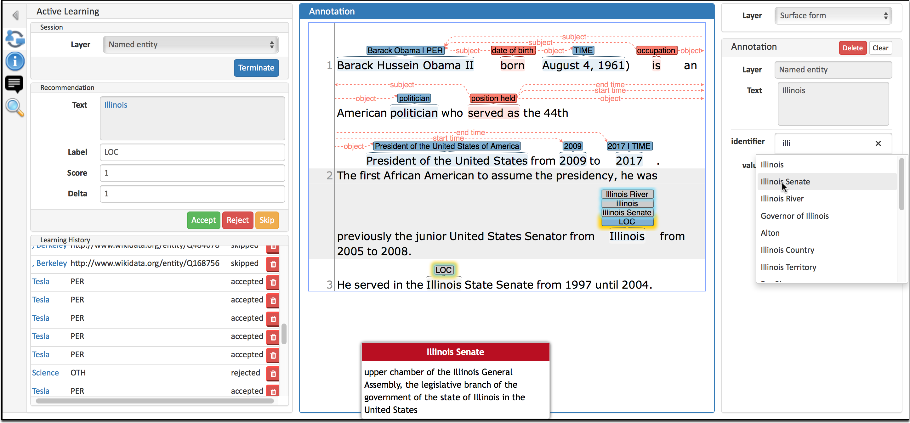

# INCEpTION

Dernière modification de la fiche : 6/07/2026

Version testée : 41.0

Site web : https://inception-project.github.io/

Code : https://github.com/inception-project/inception

Citer le logiciel : 

>Klie, J.-C., Bugert, M., Boullosa, B., Eckart de Castilho, R. and Gurevych, I. (2018): The INCEpTION Platform: Machine-Assisted and Knowledge-Oriented Interactive Annotation. In Proceedings of System Demonstrations of the 27th International Conference on Computational Linguistics (COLING 2018), Santa Fe, New Mexico, USA

## Description générale

*INCEpTION est une plateforme open source d'annotation de textes destinée à des tâches d'analyse linguistique et sémantique sur des documents écrits, accessible par une interface web.* 

Plusieurs utilisateurs peuvent travailler simultanément sur un même projet, et une seule installation peut héberger de nombreux projets en parallèle. L'outil s'organise autour de projets indépendants, pensés comme autant de campagnes d'annotation, de linguistique de corpus ou de traitement automatique des langues. L'administrateur d'un projet intègre les utilisateurs et leur attribue des rôles parmi les trois possibles : gestionnaire de campagne (manager), annotateur (annotator) et arbitre (curator). Les gestionnaires définissent les jeux d'étiquettes (tagsets), puis les couches d'annotation (layers) ou choisissent parmi ceux proposés par défaut. Ils intègrent les guides d'annotation et les éventuelles bases de connaissances permettant de lier les annotations à des entités externes comme Wikidata directement dans l'interface. Ils importent les documents à annoter et établissent les règles de répartition des documents entre annotateurs. INCEpTION permet de paramétrer une granularité d'annotation allant du caractère à la phrase et d'autoriser ou non les annotations multiples et les chevauchements. Les couches d'annotation peuvent être de trois types : annotation d'empans textuels, de relations entre empans ou de chaînes de relations entre empans. INCEpTION gère l'ensemble du cycle de vie d'une campagne d'annotation : répartition des tâches entre annotateurs, suivi de la charge de travail, mesure de l'accord interannotateurs, et arbitrage (curation) pour réconcilier les annotations divergentes de plusieurs personnes en un résultat final unique. Il propose enfin des fonctionnalités avancées comme la recherche dans les annotations, la constitution de corpus à partir de dépôts documentaires externes, l'import/export dans de nombreux formats et l'intégration de suggestions d'annotations.

## Licence

*Logiciel libre sous licence Apache-2.0*

## Installation

Possibilité de tester en ligne puis de déployer une instance avec Docker, l'installation complète est possible.

Le logiciel repose sur une architecture assez lourde (Java, Base de donnée, etc.). Le déploiement en production directement peut être assez compliquée. [Une page très claire explique les différentes démarches dans la documentation](https://inception-project.github.io/releases/41.0/docs/admin-guide.html#sect_installation).

## Corpus 

*Le logiciel est dédié aux documents textuels.¨

Le logiciel accepte de très nombreux de formats de documents (mais pas CSV, ni Excel). Il est pensé pour l'intégration de documents contenus dans un dossier : CoNLL, BioC, HTML, PDF, Text, différents formats de JSON, UIMA, WebAnno, XML, ...

Il est possible d'importer des documents comportant déjà des annotations. Dans ce cas, les couches d'annotations et les jeux d'étiquettes associés doivent avoir été décrits préalablement à l'import.

## Interopérabilité

*De nombreux formats permettent de connecter le logiciel aux pratiques métiers*

Il est possible de se connecter à de nombreux formats spécialisés. Il est possible d'exporter l'ensemble du projet. Il y a des formats spécifiques pour l'import/export des annotations (UIMA, WebAnno). Il est possible pour chaque document de l'exporter, ou exporter l'ensemble des documents annotés. Les couches d'annotations et jeux d'étiquettes peuvent également être exportés et importés (format Jason)

## Communauté

*Logiciel largement utilisé dans de gros projets et activement maintenu par sa communauté de développement et par l'institution*

L'article de référence de l'outil paru en 2018 est cité 719, et le logiciel est utilisé en routine dans des projets européens et dans des institutions. [De nombreuses publications sont associées.](https://inception-project.github.io/publications/)

Une documentation très complète tant sur la dimension usage que technique. Des tutoriaux, comme [celui de Mate-SHS](https://www.youtube.com/watch?v=dn5GGGxGbNA) 
**Il y a ce document chez [CORLI](https://corli.huma-num.fr/wp-content/uploads/2023/05/Documentation_Projet_Tutore_M1LITL_2022-1.pdf) qui peut aider à la prise ne main**

## Collaboratif

*Le collaboratif est au coeur du logiciel avec de nombreuses gestions des droits et de l'accès aux documents*

Le logiciel intègre des fonctions pour dispatcher des documents, que ce soit à des annotateurs avec compte ou anonymes, de monitorer les annotations, d'avoir une gestion d'expiration.

De nombreuses métriques sont disponibles pour mesurer l'accord inter-annotateur, et arbitrer sur les désaccords. Une fonction d'arbitrage dédiée existe (Curation).
 

## IA

*INCEpTION utilise la notion de recommanders pour greffer différentes stratégies d'annotation automatique basée sur des API externes*

Différentes stratégies pour accélérer et assister l'annotation. Le cœur du système est le recommender : des modèles qui apprennent des annotations déjà faites (ou de sources externes) pour suggérer de nouvelles annotations affichées en gris dans le texte, qu'on accepte d'un simple clic ou rejette d'un double clic. Les suggestions ne deviennent des annotations qu'après validation. 

Différents types classiques (String Matcher avec gazetteers, classifieurs OpenNLP pour POS/NER/catégorisation), modèles de langage génératifs encore expérimentaux (Ollama, ChatGPT, Azure OpenAI), ainsi que des recommenders externes via API. Intégration d'une auto-évaluation (scores F1, précision, rappel, matrice de confusion) et peuvent s'activer automatiquement selon un seuil de qualité. Fonction d'Active Learning et de Concept/Entity Linking (désambiguïsation contextuelle et suggestions du Named Entity Linker pour relier les mentions à une base de connaissances) + depuis la v41 un Assistant expérimental basé sur un LLM doté d'outils de contexte et de recommandation. 

## Prise en main

Retour d'expérience (Sandrine Ollinger) :

Le logiciel est complet, il permet de centraliser tout le matériel d'une campagne d'annotation. Un temps de prise en main est indispensable et il faut bien penser sa campagne avant de se lancer dans la création d'un projet. Il peut être utile de prendre une demi-heure avec les annotateurs, en début de campagne, pour les aider à se repérer dans l'interface et leur conseiller quelques paramètres. Une fois tout mis en place, on trouve tout ce dont on a besoin. Les différentes fonctionnalités post-annotation (Curation, Explorer, Agreement) sont très utiles. 

J'utilise une instance installée et maintenue par un service informatique et partagée par une communauté répartie sur toute la France.

Les concepteurs de la plateforme sont disponibles, que ce soit pour donner un coup de main sur des difficultés techniques ou échanger sur le développement de nouvelles fonctionnalités.

Il n'existe pas, à l'heure actuelle, de traduction française de l'interface.

