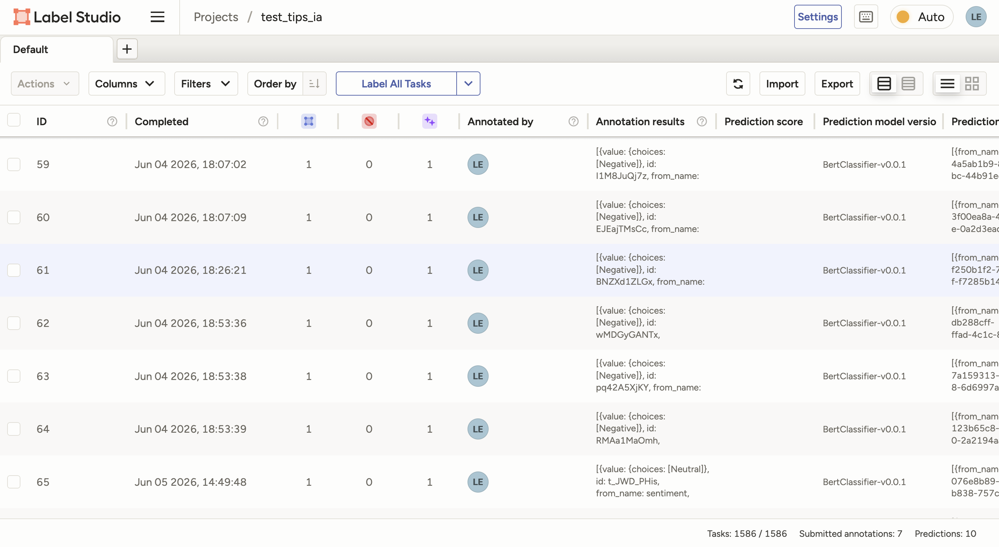
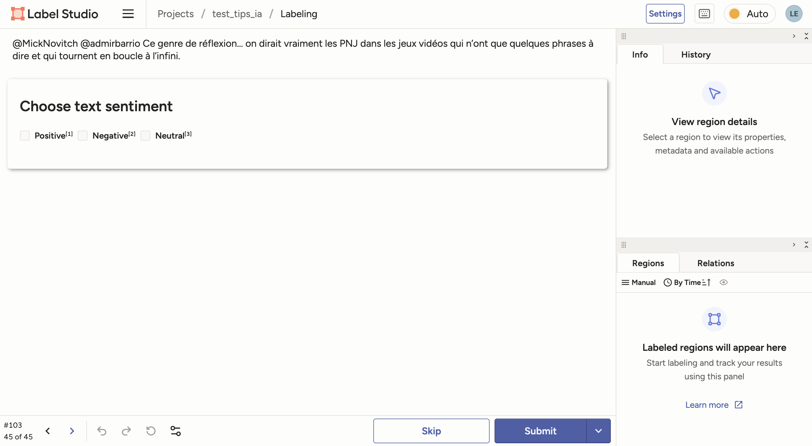

# Label Studio

Dernière modification de la fiche : 06/07/2026

Version testée : 1.23.0

Site web : [https://labelstud.io/](https://labelstud.io/)

Code : [https://github.com/HumanSignal/label-studio/](https://github.com/HumanSignal/label-studio/)

Citer le logiciel :

> @misc{Label Studio,
>   title={{Label Studio}: Data labeling software},
>   url={https://github.com/HumanSignal/label-studio},
>   note={Open source software available from https://> github.com/HumanSignal/label-studio},
>   author={
>     Maxim Tkachenko and
>     Mikhail Malyuk and
>     Andrey Holmanyuk and
>     Nikolai Liubimov},
>   year={2020-2025},
> }

  
  

<!--
SI on veut images plus basique :

 -->

## Description générale

*Logiciel (touffu) d'annotation multimodale destiné à l'annotation collaborative de grands corpus (texte, image, audio, vidéo, etc.).*

Label Studio est un logiciel d'annotation multimodale qui fonctionne sur le principe client-serveur et permet de travailler à plusieurs sur un projet. Il est pensé pour l'annotation de grands volumes de données, notamment dans une perspective d'entraînement de modèles. Il couvre un large type de tâches : texte (classification, NER), images (détection d'objets, segmentation, classification), audio (interface de transcription, diarisation des locuteurs), séries temporelles, vidéo, PDF, etc.

<!-- j'ai passé la partie soutien commercial dans la section communauté -->

## Licence

*Logiciel libre sous licence Apache-2.0.*

Il existe également deux versions payantes (Starter Cloud et Enterprise) qui proposent des services complémentaires et des fonctionnalités de gestion d'équipe. Certaines options (format parquet, etc.) ne sont disponibles que dans la version entreprise, mais la "community edition" – libre et gratuite – est pleinement fonctionnelle pour un usage en recherche.

## Installation

*Label Studio peut être installé localement ou déployé sur un serveur distant.*

<!-- SIMPLIFIER ICI -->
L'installation est possible via pip / brew / git / docker sous des machines Linux, Mac ou Windows  :
- L'installation via pip suppose de savoir ouvrir un terminal et de passer par une ligne de commande, mais elle est facile.
- Une option Homebrew est disponible pour macOS.
- Docker pourra simplifier le déploiement d'une instance collective en ligne mais requiert une familiarité avec l'outil et des compétences en administration système.

Le niveau de complexité est donc modéré : raisonnable pour un profil ayant déjà manipulé Python et un terminal, un peu plus ardu pour les non-techniciens (pas d'installation "automatique" de l'application depuis un .dmg ou .exe). La mise en production sur un serveur partagé pour une équipe nécessite des compétences en administration système. L'usage des options d'IA nécessite également une installation plus avancée et la maîtrise de Docker.  

## Corpus

*Larges possibilités d'import de corpus de types variés (texte, image, vidéo, etc.)*

Label Studio permet des données textuelles, des images, de l'audio, de la vidéo, des pdf, etc. Les formats d'entrée sont variés :

- Images (bmp, gif, jpg, jpeg, png, svg, webp)
- Audio (wav, mp3, flac, m4a, ogg)
- Video (mp4, webm)
- HTML / HyperText (html, htm, xml)
- Text (txt)
- Structured data (csv, tsv, json)
- PDF

## Interopérabilité

*Le logiciel permet l'import/export de données multimodales dans de nombreux formats standards et spécialisés*

Les formats d'import (voir ci-dessus) sont très variés.  
Les formats d'export sont des standards connus (json, csv, tsv), ou plus spécifiques selon le type de données (CONLL2003, COCO, YOLO, Brush).

## Communauté

*Un logiciel avec une documentation riche en raison de son soutien commercial et de nombreux supports en anglais, mais moins investit par la communauté de recherche francophone*

- La documentation officielle : https://labelstud.io/guide/
- Des tutoriels : https://labelstud.io/tutorials/

Le projet a 27k étoiles sur GitHub et, étant développé par une entreprise (HumanSignal), il bénéficie de sa force de frappe commerciale pour sa [documentation](https://labelstud.io/guide/), la création de [tutoriels](https://labelstud.io/tutorials/), un groupe d'échange sur [Slack](https://slack.labelstud.io/), etc. La majorité des supports et de la communauté est anglophone. L'adoption par la communauté universitaire francophone semble plus en retrait.

## Collaboratif

*Le logiciel est largement pensé vers les tâches d'annotation multi-utilisateurs et il est possible de collaborer à plusieurs sur un projet.*

Dans le cas de l'usage collaboratif en ligne : il n'existe pas d'instance publique mutualisée gratuite compatible avec des données de recherche sensibles. Une instance est néanmoins disponible dans la stack Onyxia du [datalab sspcloud de l'INSEE](https://datalab.sspcloud.fr), mais la plateforme est limitée aux "données publiques et données usuelles (données de travail sans sensibilité particulière)".

Il reste possible d'installer soi-même une instance en ligne si l'on a accès à des serveurs et aux compétences nécessaires (ou de souscrire à l'offre cloud payante de HumanSignal – mais il faudra dans ce cas vérifier les conditions concernant les données sensibles).

## IA

*L'IA repose sur des modèles externes et reste optionnelle, avec une intégration poussée pour l'assistance à l'annotation et les workflows d'entraînement.*

L'utilisation de l'IA n'est pas obligatoire et l'on peut rester sur une volonté d'annotation purement manuelle. Mais plusieurs templates de labellisation montrent une orientation forte vers les workflows RLHF, les pipelines ML/IA, y compris l'évaluation de LLMs et leur fine-tuning, RAG, l'évaluation de chatbots, etc.  
NB : L'utilisation des possibilités d'IA suppose de connecter des modèles depuis une installation d'un backend ML avec Docker.

## Prise en main

**Retour d'expérience (Léo Mignot) :**

***Hot-Take : Fait tout. Et trop.***  
Le logiciel est beau, l'UI est bien pensée et les vidéos d'explication ainsi que la doc sont bienvenues. La création de projets et de schémas d'annotation est facilitée par l'interface d'import de données et l'existence de templates de labellisation (qu'il est possible de modifier, ou de créer de zéro). Le tout est très "pro". Néanmoins, l'expérience utilisateur pour le débutant n'est pas évidente. Il n'est pas facile de s'y retrouver dans la myriade d'options : il y a énormément de possibilités, sans que l'on soit super guidé sur ce qui marche dans nos cas d'usage ou non, ni pourquoi. Les configurations et le workflow ne tombent pas forcément sous le sens pour les néophytes. Il y a un côté "je peux tout faire, mais comment ?".

Si l'installation de base est facile pour qui sait ouvrir un terminal et connaît Python, ce n'est pas la même limonade s'il est question de connecter soi-même le tout à des modèles qu'il faut faire tourner depuis leur label-studio-ml-backend avec Docker.

N.B. : La doc n'est pas toujours très cohérente sur la version de Python minimale nécessaire (selon les endroits sont mentionnées la v 3.6, 3.8, 3.10). L'installation via pip a ici marché sans problème avec Python 3.10.