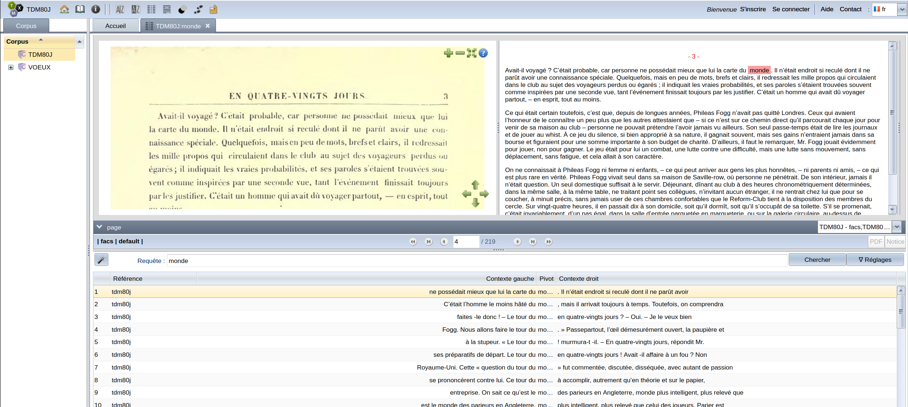

# TXM

Dernière modification de la fiche : 02/09/2026

Version testée : O.8.4

Site web : [https://txm.gitpages.huma-num.fr/textometrie/index.html](https://txm.gitpages.huma-num.fr/textometrie/index.html)

Code : [https://gitlab.huma-num.fr/txm/txm-src](https://gitlab.huma-num.fr/txm/txm-src)

Citer le logiciel : 

en français :
> @misc{heiden2010txm,
> title={TXM: Une plateforme logicielle open-source pour la textom{\'e
> trie--conception et d{\'e}veloppement, in “JADT 2010: 10th International
> Conference on the Statistical Analysis of Textual Data”},
> author={Heiden, Serge and Magu{\'e}, Jean-Philippe and Pincemin, B{\'e}n{\'e
> dicte},
> year={2010},
> publisher={Rome}
> }

en anglais :
> @inproceedings{heiden2010txm,
> title={The TXM platform: Building open-source textual analysis software
> compatible with the TEI encoding scheme},
> author={Heiden, Serge},
> booktitle={Proceedings of the 24th Pacific Asia conference on language
> information and computation},
> pages={389--398},
> year={2010}
> }

## Description générale

TXM est un logiciel de textométrie. Il permet d'effectuer des requêtes sur les mots, lemmes, combinaison de mots/lemmes dans l'ensemble d'un corpus. Il est ainsi possible d'identifier des *patterns* et de les analyser.

L'ensemble des outils de la textométrie est implémenté : comptage d'occurrences, concordancier, spécificité, analyse factorielle des correspondances, classification hiérarchique ascendante, progression temporelle...

Un [chapitre](https://txm.gitpages.huma-num.fr/txm-manual/annoter-un-corpus.html) dédié à l'annotation est présent dans la documentation du logiciel.

## Licence

Logiciel libre et gratuit d'usage

Type de licence : GNU General Public License version 2

## Installation

Un installeur binaire est disponible sur Windows, Mac, Linux. Son installation est détaillé [ici](https://txm.gitpages.huma-num.fr/txm-manual/installation.html)

Pour bénéficier de l'approche par lemmes, il faut installer l'extension et les modèles TreeTagger. C'est intégré dans le logiciel (Fichier > Ajouter une extension)

L'installation d'un portail web TXM (serveur) est aussi [disponible](https://txm.gitpages.huma-num.fr/textometrie/files/software/TXM%20portal/)

## Corpus 

4 types de corpus sont possible :  textes écrits, transcriptions d’enregistrements avec synchro audio, corpus alignés (par exemple, la même version d'un texte en plusieurs langues) et corpus en tableau (comme le résultat d'enquête ou autre...)

L'import d'un corpus va du presse-papier, à un dossier formé d'un fichier .csv (métadonnées) et différents fichiers txt, doc, odt ou rdf, mais également des formats XML variés y compris TEI.

## Interopérabilité

Oui, des corpus venus d'Iramuteq, Hyperbase et Cordial peuvent être importés.
Iramuteq permet d'importer un corpus TXM.

## Communauté

Une communauté très active existe avec un [wiki](https://groupes.renater.fr/wiki/txm-info), une [liste renater de diffusion](https://groupes.renater.fr/sympa//info/txm-info/) ainsi qu'un [site web dédiés aux développeurs](https://txm.gitpages.huma-num.fr/txm-manual/assistance-communautaire-et-documentation-compl%C3%A9mentaire.html#le-site-web-du-projet-textom%C3%A9trie) qui veulent participer au développement du logiciel. 

Une [FAQ](https://txm.gitpages.huma-num.fr/textometrie/files/documentation/faq/), bien pratique, est disponible.

## Collaboratif

La possibilité de travail collaboratif n'est pas intégrée nativement dans l'outil. 
Toutefois, cette [page](https://groupes.renater.fr/wiki/txm-info/public/travail_collaboratif) liste des ressources externes pouvant être mobilisées en cas de travail collaboratif.

Le mode server permet aussi de donner accès à plusieurs personnes à un corpus.

## IA

Il n'y a pas d'implétentation de l'IA dans le logiciel.

## Prise en main

**Retour d'expérience (Max Beligné) :**

C'est un logiciel qui demande un peu de temps avant d'être à l'aise et de bien comprendre toutes ses possibilités. La documentation est bien faite, la liste renater de diffusion est très réactive. Des corpus de démonstrations sont disponibles dès l'installation du logiciel et des ateliers sont régulièrement organisés.
Les fonctionnalité d'annotations sont loin d'être le coeur du logiciel mais dans le domaine de la textométrie, c'est une référence. 